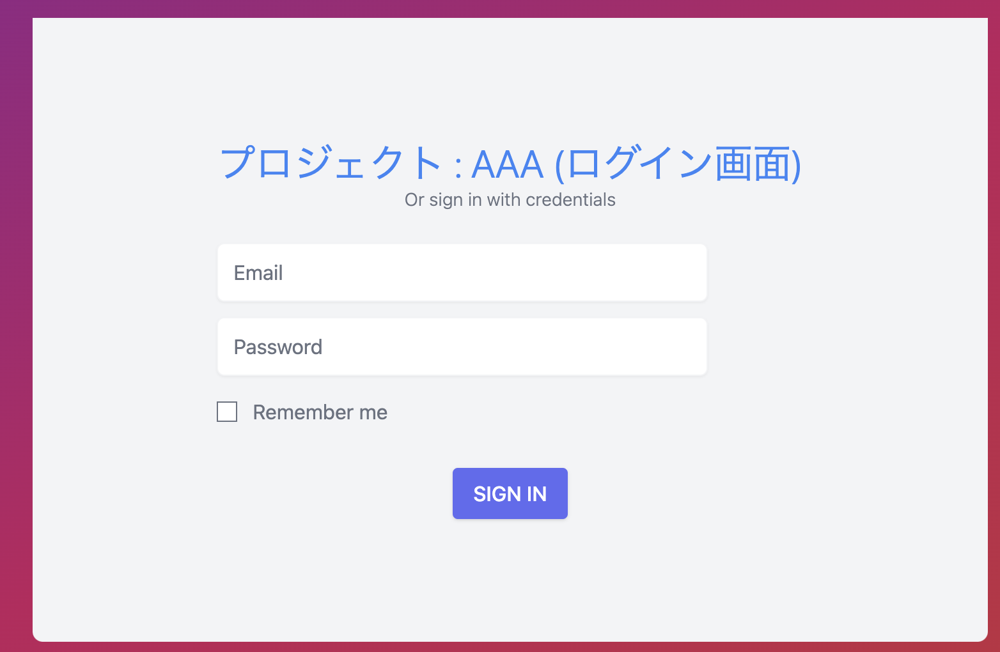
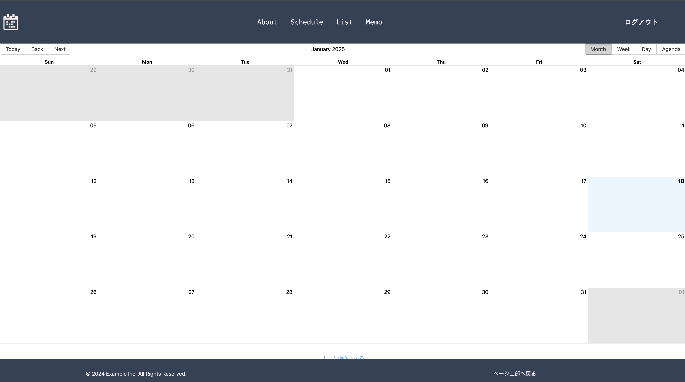
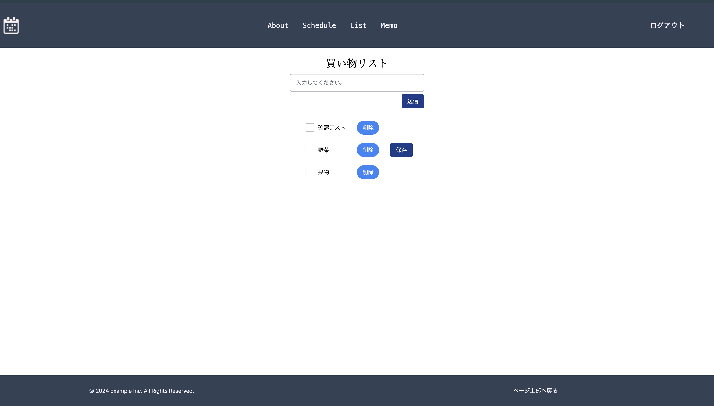
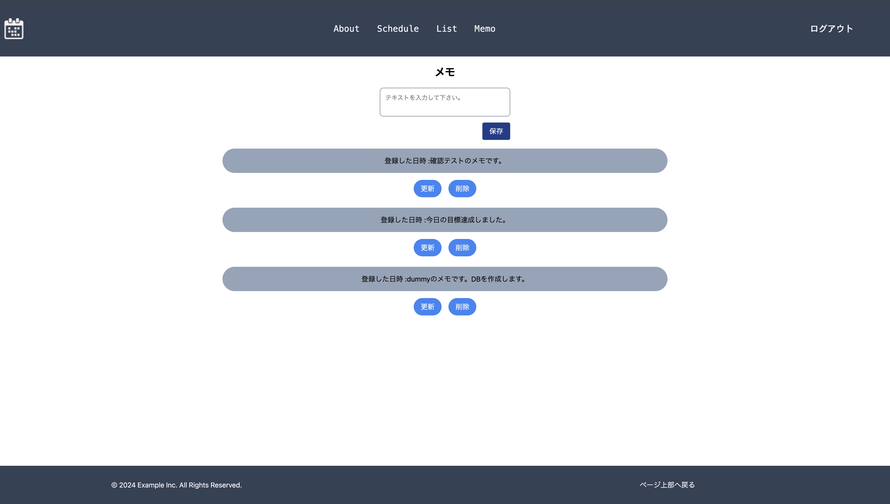
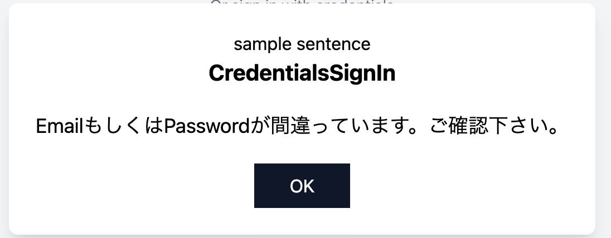

This is a [Next.js](https://nextjs.org/) project bootstrapped with [`create-next-app`](https://github.com/vercel/next.js/tree/canary/packages/create-next-app).

# 管理アプリ(schedule app)

## status

現在成果物として開発中。  
Currently being developed as a deliverable

### 開発理由 (Reason for development)

React, Next.js にとても興味があり成果物として開発中です。  
TypeScript, JavaScript, Angular の経験を元に React, Next.js を学びました。

I am very interesting development that use the React and Next.js.  
In the base of experience develop TypeScript, JavaScript and Angular, I learned React and Next.js.

## 概要, 主な機能(Summary and main function)

#### ユーザのスケジュール管理アプリを開発中です。以下に主な機能をまとめます。

#### It's development for now and can manage the user schedule. I will summarize the main function in the below.

- カレンダー:  
  ユーザーは予定をカレンダーに登録できます。  
  データの作成と削除が可能。今後、mongoDB へ連携予定。

  Calender:  
  The user can make the plan in the Calender(can make and delete) => Planed to retain in DB

- リスト機能:  
  ユーザーは Todo リストを作成できます。今後、mongoDB へ連携予定。  
  input ボックスに入力を行い、送信ボタンを押下すると画面上に入力した内容が反映されます。チェックボックス機能を保持します。

  List:  
  The user can make the Todo List => Planed to retain in DB
  If user input the something stuff and then push send button, appear the input stuff in the below. this function has checkbox.

- メモ機能:  
  この機能はリスト機能と似ています。今後、mongoDB へ連携予定。
  リスト機能との違いはユーザーが編集ボタンを押下すると編集ページへ遷移することです。

  Memo:  
  It's function similar to the List function => also planned to retain in DB
  If the user push the update button, user can get into the edit page  
  this is the different fot the List function.

- ログイン: ユーザーはトップページからアカウントとパスワードを利用してアプリへログインできます。今後、user info を mongoDB へ連携予定。NextAuth サービスを利用することによってユーザーはログイン時、csrf-token を取得し、API コール時などこれを保持している必要があります。(cookie 管理)

  Logged In: The user can logged in this app. (Planned to retain DB for user info.)
  Use the NextAuth session and can get the token from the NextAuth. User has to have the csrf-token when the logged in and API call or something.

- ログアウト: ユーザーはアプリからログアウトできます。ログアウト時、保持していた token を削除します。

- Logged out: The user can logged out in this app. Remove the all token when the user logged out.

### 使用技術(Use technology)

- TypeScript
- React (ver18)
- Next.js
- NextAuth
- tailwindcss
- react-big-calender
- mongo DB
- mongoose

### デモ画面(Demo)

ログイン画面(Logged in)

カレンダー画面(Calender)

リスト画面(List)

メモ画面(Memo)

モーダル画面(Modal)

※モーダル機能はアプリ全体で共通化部品。
